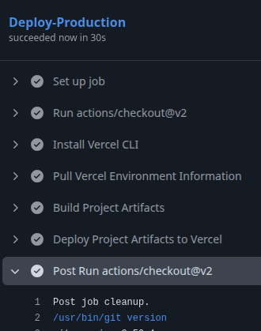

`/api/index.js` : Point d'entrée de l'application

`/api/tests/index.tests.js` : Fichier de tests de l'application

`./vercel.json` : Fichier de configuration pour le déploiement sur vercel

`./github/workflows/*.yaml` : Fichers de configuration de workflows

# Workflows
Les workflows se décomposent comme suit : 
