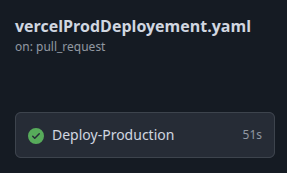

# Overview
- [Description](#description-du-projet)
  - [Stack utilisée](#stack-technique)
- [Workflows CICD](#workflows)
  - [1. Les tests](#1-testsandbuildyaml)
  - [2. Déploiement en preview](#2-vercelpreviewdeployementyaml)
  - [3. Déploiement en production](#3-vercelproddeployementyaml)

# Description du projet
API REST conçue pour piloter un bot, probablement dans un contexte de jeu (d'où le nom "botwar"). L'API permet de définir et de récupérer la prochaine action que le bot doit effectuer.

# URL du bot
Le bot est accessible à l'url : https://node-api-vercel-teal-phi.vercel.app

## Stack technique
- API : Nodejs + Express
- DB : Postgres (Vercel Neon Database)

___

- **`api/index.js`** : Point d'entrée de l'application, construit avec Express.js. Gère la connexion à la base de données PostgreSQL pour stocker et récupérer les mouvements du bot.
- **`api/tests/index.tests.js`** : Fichier de tests pour l'API.
- **`vercel.json`** : Fichier de configuration pour le déploiement sur Vercel.
- **`.github/workflows/*.yaml`** : Fichiers de configuration pour l'intégration et le déploiement continus (CI/CD) avec GitHub Actions.

# Workflows
Les workflows d'automatisation se décomposent comme suit :

## 1. `testsAndBuild.yaml`

- **Nom :** `Tests Jest et Build de l'image`
- **Objectif :** Assurer la qualité du code avant sa fusion dans la branche principale.
- **Déclencheur :** Se lance à chaque `push` sur n'importe quelle branche, sauf `main`. Ce fichier permet en priorité d'assurer l'intégrité des nouvelles features.
- **Actions principales :**
  - Installation de Node.js et des dépendances du projet.
  - Exécution des tests unitaires avec `npm test`.
- **Rôle :** Workflow d'**Intégration Continue (CI)** qui garantit que les nouvelles modifications n'introduisent pas de régressions.

## 2. `vercelPreviewDeployement.yaml`

- **Nom :** `Vercel Preview Deployment`
- **Objectif :** Déployer une version de preview de l'application.
- **Déclencheur :** Se lance lors de la création d'une `pull request` vers la branche `preview`.
- **Actions principales :**
  - Construire le projet.
  - Déployer une version de prévisualisation sur Vercel, générant une URL unique pour tester les changements.
- **Rôle :** Workflow de **Déploiement Continu (CD)** qui permet de valider les fonctionnalités en ligne avant de les intégrer à la branche principale.

## 3. `vercelProdDeployement.yaml`

- **Nom :** `Vercel Production Deployment`
- **Objectif :** Mettre en production la version stable de l'API.
- **Déclencheur :** Se lance lors d'une `pull request` vers la branche `main`.
- **Actions principales :**
  - Construit le projet pour la production.
  - Déploie l'application sur l'URL de production de Vercel.
  - Construit une image Docker de l'application en tant qu'artefact.
- **Rôle :** Workflow de **Déploiement Continu (CD)** final qui met à jour l'application pour les utilisateurs finaux. 
